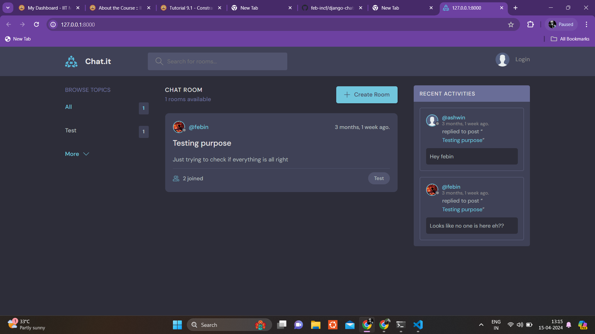
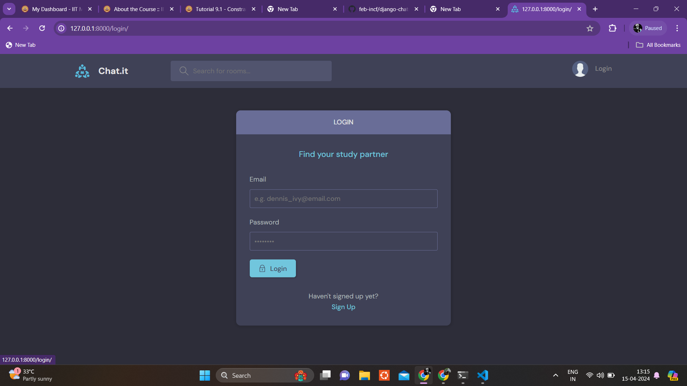
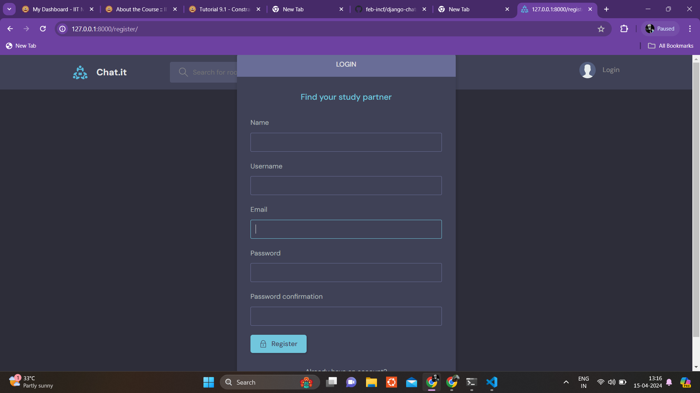
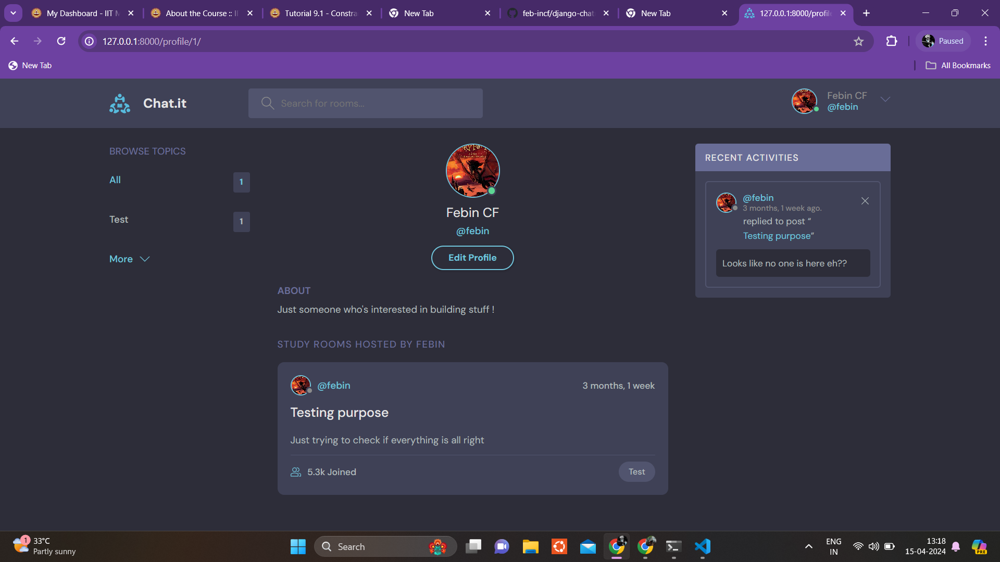
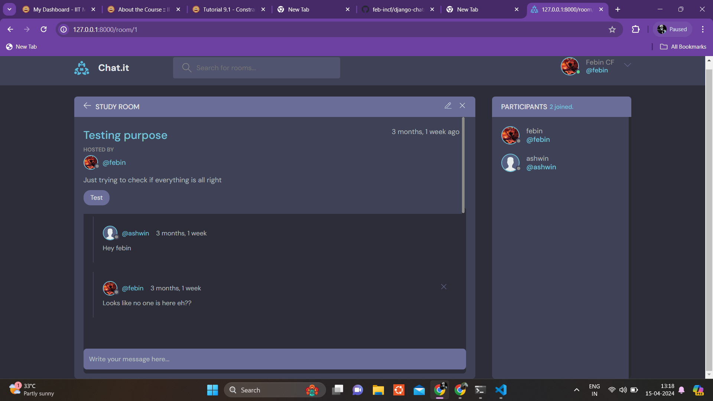
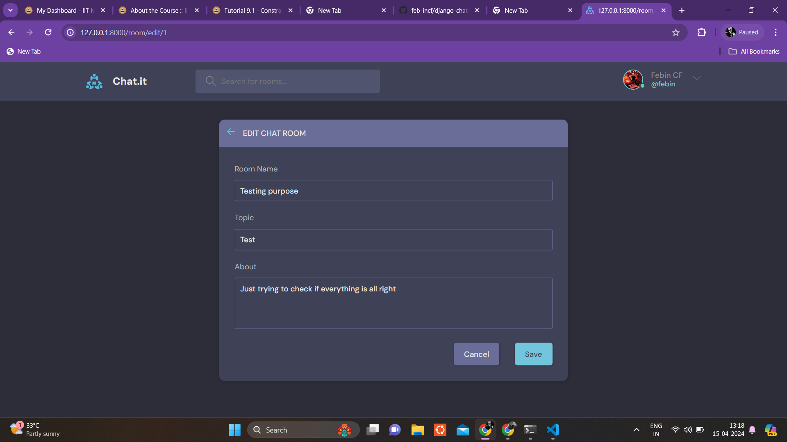

## Run Locally

Clone the project

```bash
  git clone https://github.com/feb-incf/django-chatroom.git
```

Go to the project directory

```bash
  cd django-chat-application
```

Initiate and activate Virtual Environment

```bash
  python3 -m venv .env &&

  source .env/bin/activate
```

Install depedencies from requirements.txt file

```bash
  pip install -r requirements.txt
```

cd into main project directory

```bash
  cd app
```

Start the server

```bash
  python manage.py runserver
```


# Chat.it Chat application

Chat.it is a chat application where users can create various topics and rooms under a certain topic. This app allow other users to join a room and chat. It gives the room creater the ability to manage rooms and users in that room.


## User Interface



The Design of the homepage is good interms of both UI and Ux.


## Features

#### Login page


Login page which shows error message if the user is not an existing user or incase of wrong inputs. Since the web pages are generated on the server side there's only backend validation.


#### Signup page


Signup page for new users.


#### User profile



User profile page allows other users to view your profile and vice-versa. It has user profile photo, username etc.

#### Chat Rooms



Chat room page allows the creator to edit, delete and manage users who are joined in that specific room. Other users can send and delete their messages.




Room creator can manage rooms.
